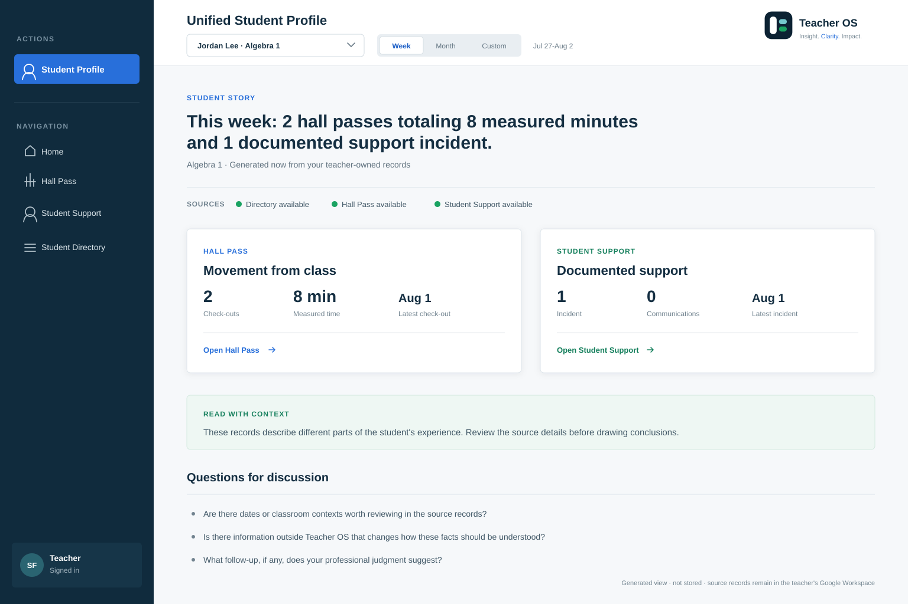
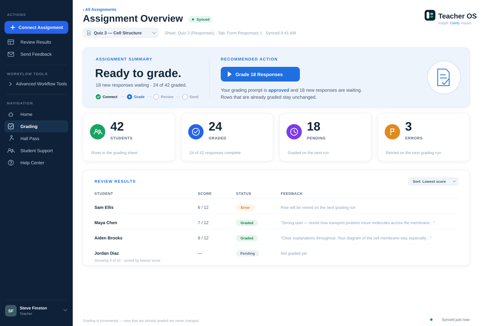
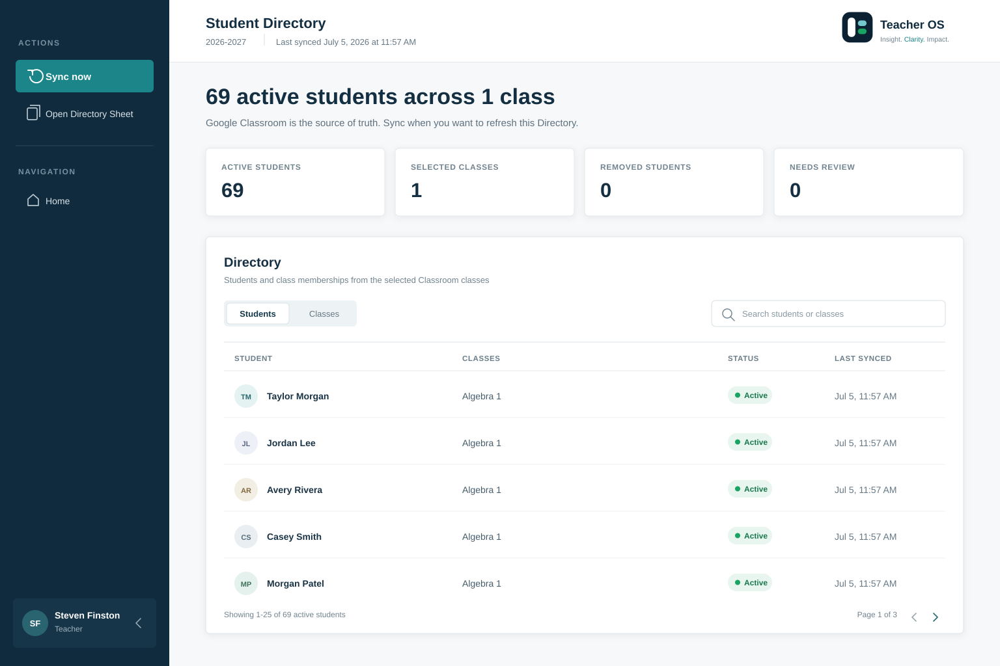

# Teacher OS

## A technical case study in classroom workflow software

Teacher OS is a live, privacy-conscious classroom operations platform I designed and developed around the work between teaching: grading, documenting, communicating, and walking into a meeting prepared.

It adds an operational layer across the tools teachers already use while keeping the teacher—not an algorithm—as the professional making the decision.

[View Teacher OS](https://www.theteacheros.com) · [GitHub profile](https://github.com/stevefinston) · [LinkedIn](https://www.linkedin.com/in/steven-finston-64a2ba413/) · [Public résumé](https://www.linkedin.com/in/steven-finston-64a2ba413/details/featured/)

> **Evidence status:** designed, implemented, tested, and deployed. Selected authenticated owner workflows have been production-verified. External-teacher adoption and measurable outcome evidence are still pending.

## View the case-study site locally

```bash
npm install
npm run dev
```

Then open `http://localhost:3000`. The private Teacher OS application source is not included in this repository.

## The operational problem

Teachers already work across Google Forms, Sheets, Classroom, Gmail, local files, and conversations. The expensive part is not collecting one more data point. It is reconstructing the story: what happened, what needs attention, what to say, and what to do next.

Teacher OS is designed around three recurring loops:

- **Grade:** move a real response source through readiness, grading, review, reporting, and feedback.
- **Document:** capture Hall Pass, support, identity, and progress records in teacher-owned systems.
- **Communicate:** generate factual drafts and meeting artifacts while preserving teacher review and explicit control.

The primary operator is the classroom teacher. Families, counselors, and school leaders are served as audiences of what the teacher brings to a meeting—not as owners of the workflow.

## My role and contributions

I served as product owner, developer, and educator-domain expert.

I owned product intent, prioritization, workflow definition, architecture and privacy decisions, release scope, and launch gates. I directed and contributed to full-stack implementation, testing, UX refinement, technical documentation, and production verification through an AI-assisted development workflow.

I retained responsibility for decisions and irreversible actions. Coding agents worked inside versioned architecture rules, exact-commit review, automated checks, and narrow release boundaries.

## The product system

### Grading Workspace

Moves a response Sheet through compatibility checks, workflow state, AI-assisted grading, review, reporting, and teacher-approved feedback. A tested state model keeps the next recommended action consistent with the assignment’s real prerequisites.

### Hall Pass

Pairs a student check-out/check-in flow with a supervisory teacher workspace, deterministic pattern detection, student reports, and a review-first communication workflow.

### Student Support Log

Turns classroom documentation into factual, editable summaries, meeting artifacts, and teacher-approved family communication. The product is explicitly framed as documentation and support—not discipline surveillance.

### Student Directory and Students

Uses Google Classroom-backed identity to compose progress, Hall Pass, and support facts for one exact active student. The combined view is generated at request time, marked private/no-store, and never persisted as a centralized student profile.

### Student Progress

Previews bounded Sheet or CSV sources, requires explicit confirmation, matches exact active Directory identities, and persists an atomic active batch to a teacher-owned workbook. Ambiguous structure or date meaning stops the workflow instead of producing misleading metrics.

### AI Authoring

Publishes a provider-neutral protocol for creating gradeable Google Forms with a teacher-selected personal AI. Teacher OS does not proxy the authoring conversation, choose the provider, or receive the authoring material through that protocol.

## Product interface

The following canonical product-reference visuals contain synthetic data only. No live student or teacher information is included.



*Students overview — deployed and production-verified workflow; synthetic data.*



*Grading Workspace — production visual reference; synthetic data.*



*Student Directory — approved deployed workflow reference; synthetic data.*

## Technical architecture

Teacher OS is a TypeScript/React application built with Next.js App Router and deployed on Vercel.

```text
Teacher browser
  └─ responsive, authenticated workspaces
       ↓
Next.js application on Vercel
  ├─ thin API routes
  ├─ Google I/O and persistence stores
  ├─ pure workflow, validation, and analysis libraries
  └─ co-located automated tests
       ↓
Integrations
  ├─ Google Drive + Sheets: student records and artifacts
  ├─ Google Classroom: roster identity
  ├─ Gmail: explicit teacher-approved sends
  ├─ OpenAI: bounded generative grading and drafts
  ├─ Neon Postgres: pointers, settings, entitlements, aggregate events
  └─ Stripe: billing lifecycle
```

The core code convention is thin route → store/service boundary → pure library. Handwritten validators, explicit state machines, and fail-closed guards keep ambiguous input away from writes and user-facing claims.

## Important product and engineering decisions

1. **Google Workspace remains the system of record.** Student work, rosters, logs, grades, and feedback stay in teacher-owned files. The platform metadata database stores pointers and operational metadata, not student payloads.
2. **Cross-module views are generated, not stored.** This reduces centralized privacy risk and avoids quietly creating a new student-profile database.
3. **Outbound communication is review-first.** AI may draft, but a teacher edits, confirms the recipient, and explicitly sends. Teacher OS does not send student- or family-facing communication autonomously.
4. **Deterministic logic is preferred when it can do the job.** Parsing, readiness checks, workflow state, and classroom insights use testable rules. Model calls are reserved for genuinely generative work.
5. **Failure states are part of the product.** `setup-required`, `no-records`, and `unavailable` are intentionally different. Ambiguous data is rejected rather than silently coerced.
6. **Changes ship through small, inspectable release surfaces.** Implementation, co-located tests, pull-request review, exact-commit gates, CI, deployment monitoring, and documentation form one delivery loop.

## Privacy, security, data ownership, and responsible AI

- Student records remain in the teacher’s own Google Workspace.
- The metadata layer is designed to hold pointers, settings, entitlement state, and counts-only operational events—not student data.
- OAuth is designed around least privilege, including file-scoped Drive access and read-only Classroom roster access.
- Student-facing and family-facing communication requires explicit teacher review and action.
- Generated language is constrained to factual, non-diagnostic communication.
- AI contracts are versioned rather than assembled ad hoc.
- Deterministic checks protect the workflow before generative calls or writes.

This is a product architecture and implementation claim—not a claim of independent security certification or district approval.

## How AI assisted development

Teacher OS used an explicit human-and-agent development model. ChatGPT supported architecture, UX, risk, and roadmap review. Claude and Codex supported implementation, tests, pull-request preparation, release review, and deployment verification.

I retained control of product intent, scope, protected actions, privacy boundaries, and launch decisions. Generated code was treated as a proposal that had to survive repository rules, automated tests, build checks, exact-commit review, and deployment evidence.

## Difficult problems, constraints, and tradeoffs

- Joining records across modules without persisting a centralized student profile.
- Matching imperfect imported records to one exact active Directory identity.
- Keeping Google Workspace teacher-owned while still delivering a coherent application experience.
- Making AI useful without making outbound actions autonomous.
- Recovering safely from malformed, stale, ambiguous, or incomplete Sheets.
- Migrating a mature Apps Script workflow into a production web product.
- Separating green CI and successful builds from actual live-integration proof.

The central tradeoff is intentional: Teacher OS accepts more integration and runtime-composition complexity in exchange for teacher ownership, reversibility, and a smaller privacy surface.

## Testing, deployment, iteration, and feedback evidence

On August 25, 2026, a clean checkout of the current private `main` branch passed:

- TypeScript type checking
- **1,311 automated tests across 89 test files**
- The optimized production build

The corresponding latest `main` CI run completed successfully, and the current Vercel production deployment reported **Ready**.

Repository evidence records authenticated production verification for selected owner workflows, including identity, Directory, student-composition, and release-specific paths. Product history also shows iterative changes based on educator workflow and pilot-teacher input.

What this does **not** yet establish:

- A completed external-teacher cohort
- A verified time-saved metric
- A public testimonial
- School or district adoption
- Comprehensive live proof of every product path

The repository includes counts-only event instrumentation and a planned invitation-only pilot with explicit onboarding, reliability, active-use, and self-reported time-saved criteria. Those criteria are targets, not results.

## What I learned

- Trust is built through predictable boundaries, honest empty states, and reversible actions.
- Operational UX is largely sequencing, defaults, recovery, and removing duplicate decisions.
- AI-assisted development needs an authority model and verification contract, not only prompting skill.
- Versioned product documentation can function as engineering infrastructure.
- Product maturity and market validation are different evidence categories and should be reported separately.

## What I would improve next

- Complete the external-teacher pilot and publish verified outcome evidence.
- Create a dedicated synthetic demo account and repeatable screenshot library.
- Run independent accessibility, dependency, privacy, and security reviews.
- Establish mobile-performance and core-workflow latency baselines.
- Simplify onboarding using observed cohort friction rather than assumptions.

## Technical skills demonstrated

- Product discovery and workflow modeling
- TypeScript, React, and Next.js App Router
- Full-stack API and state-machine design
- Google Drive, Sheets, Classroom, and Gmail integrations
- OAuth and least-privilege architecture
- Postgres metadata modeling and privacy boundaries
- AI grading, feedback, and provider-neutral prompt contracts
- Automated testing, CI/CD, and deployment verification
- Release governance, technical writing, and architecture documentation
- Responsive interface and professional-report design

## 60–90 second demonstration

1. **0–10 seconds:** Open Home and name the fragmented work Teacher OS connects.
2. **10–25 seconds:** Preview a synthetic Student Progress CSV; show bounded sampling and explicit mapping confirmation.
3. **25–42 seconds:** Open Students for fictional Jordan Lee; show exact-identity composition and coverage states.
4. **42–57 seconds:** Open a synthetic grading assignment; move across compatibility, grade, review, report, and feedback milestones.
5. **57–70 seconds:** Generate and edit a communication draft; show recipient confirmation and stop before Send.
6. **70–85 seconds:** Close on the architecture, current test/deploy proof, and the outcome evidence still pending.

---

Teacher OS is my primary development project and the clearest example of how I approach software: begin with real operational friction, protect the user’s authority, make technical boundaries explicit, and report evidence honestly.
